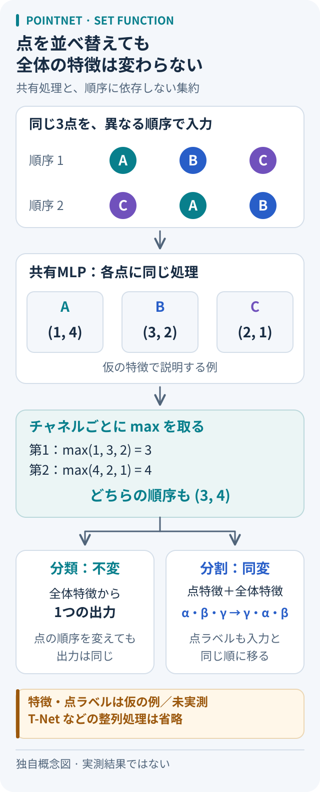

# PointNet：点の並び順を変えても、同じ形と判断するには

出典確認：2026-10-05。原論文の機構と本稿の想定例を区別する。学習・推論の追試は未実施。

## 問い：順序のない点群をどう読むか

同じ椅子の点群をファイルへ保存するとき、点の行を入れ替えても椅子は変わらない。PointNetは、この性質を処理の構造に組み込み、点の座標から形状分類や点ごとの部位分割を行う。ボクセル化や画像への投影を必須にしない。[原論文 §1・3][paper]

## 原著の機構：共有MLPと対称な集約

各点へ同じ重みのMLPを適用し、Kチャネルの特徴を作る。次に、**チャネルごとに全点の最大値**を取り、K次元の全体特徴へまとめる。最も大きな特徴ベクトルを丸ごと一つ選ぶ操作ではない。分類器はこの全体特徴を使うため、点の順序に依存しない。この中核は「点ごとの変換h → max → 出力変換γ」と読める。[原論文 §4.2・図2][paper]

分割では、全体特徴を各点の特徴へ連結し、共有された処理で点ごとのスコアを出す。[原論文 §4.2][paper] ここから整理すると、分類は並べ替えに対する**不変性**、分割は入力を並べ替えると出力の点ラベルも同じ順に移る**同変性**を持つ。分割結果を比較するときは、行番号ではなく対応する点を照合する。

図：本稿独自の概念図。T-Netなどを省略し、仮の特徴で集約を説明する。論文図の転載や実測結果ではない。

## 3点・2チャネルで考える：本稿の想定例

共有MLPの出力を仮にA＝(1, 4)、B＝(3, 2)、C＝(2, 1)とする。これは座標や測定値ではない。点をA、B、Cと並べてもC、A、Bと並べても、チャネル別maxは(3, 4)になる。第1チャネルはB、第2チャネルはAが最大値を支える。

この固定した特徴ならCを除いても全体特徴は保たれる。一方、Aを除けば(3, 2)へ変わる。仮にD＝(5, 0)を追加すると(5, 4)へ変わる。「順序が変わる」「点が欠ける」「外れ点が入る」は、別々の試験にすべきだと分かる。

## T-Netと理論を、どこまで保証と読めるか

T-Netは入力座標や中間特徴に掛ける変換行列を学習し、整列を助ける。特徴変換には直交行列へ近づける正則化も使う。[原論文 §4.2][paper] 本稿の整理では、これは任意の3次元回転に対する厳密な不変性の保証とは区別する。点の並べ替えで座標値は変わらないが、回転では変わるため、学習した整列が成功するかを別に確かめる必要がある。

定理1は、固定点数・有界領域の点集合上で、Hausdorff距離に関して連続な集合関数を、十分な特徴次元で近似できると述べる。定理2では固定した点ごとの関数hについて、各チャネルの最大値を支える点を集めれば、**高々K点のcritical point set**が全体特徴を決める。その点を残し、各チャネルの最大値を超えない点だけを足す範囲で出力は保たれる。[原論文 §4.3・補足G][paper]

これは有限の実装幅や通常の学習で最適解に到達する保証ではない。本稿の注意点として、重要な点の欠落や最大値を更新する外れ点は条件外になる。また、点の削除でT-Netの整列自体が変わる場合に、固定hの説明をそのまま適用しない。

## 使いどころと次に読むもの

本稿では、点群を直接扱う分類・分割の基準となる構成として読む。点ごとの共有処理は、近傍を明示的に集める処理とは異なる。細かな局所形状や密度の違いを扱う発展は[PointNet++](pointnet-plus-plus.md)へ。評価前には[点群評価の横断ノート](../../topics/point-cloud-evaluation.md)でサンプリング・回転・欠損の条件をそろえる。[CAD・3Dの入口](../../topics/README.md#cad-3d)にも関連資料をまとめる。

## 一次資料と確認範囲

- Qi, Su, Mo, Guibas, *PointNet: Deep Learning on Point Sets for 3D Classification and Segmentation*, CVPR 2017。
- [原論文（arXiv:1612.00593v2、2017-04-10）][paper]：§1、3、4.1–4.3、図2、補足Gの定理と証明を確認。技術説明の根拠はこの著者公開版。
- [著者プロジェクトページ][project]：会議年、Architecture、原論文へのリンクを確認。
- [CVF公式掲載ページ][cvf]：2026-10-05の取得は403応答。本文の確認には著者ページ経由のarXiv版を使用した。
- 確認日：2026-10-05。コード実行・精度・速度の再測定は行っていない。

[paper]: https://arxiv.org/pdf/1612.00593v2
[project]: https://stanford.edu/~rqi/pointnet/
[cvf]: https://openaccess.thecvf.com/content_cvpr_2017/html/Qi_PointNet_Deep_Learning_CVPR_2017_paper.html
