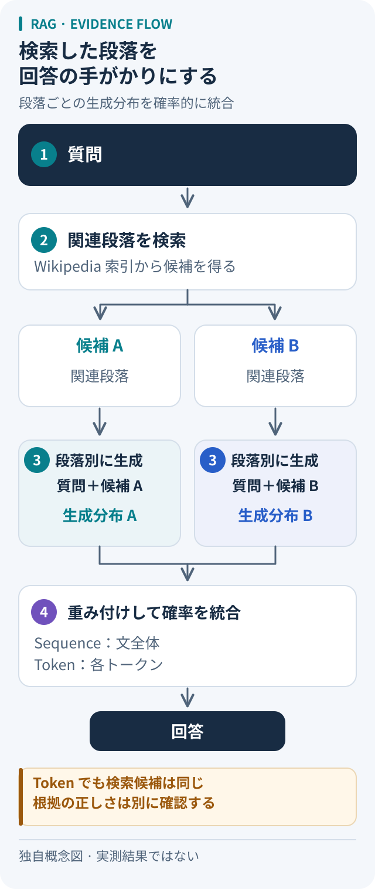

# RAG：答えを書く前に、どの資料を読むか

「青波町の図書館は、日曜は何時に閉まる？」。これは説明用の架空の質問だ。流暢な答えが返ってきても、町も施設も取り違えていたら役に立たない。RAGを読む入口は、文章を作る能力と、必要な情報を取り出す能力を分けて考えることにある。

本稿はLewisらの2020年の方式を扱う。検索した文章を生成に使う仕組み全般を指す広い意味の「RAG」と、この論文固有の学習・確率モデルを区別して読む。

## 原著の仕組み：検索と生成をつなぐ

**検索器DPR**が質問に関連するWikipediaの段落を選び、**生成器BART**が質問と各段落から出力の確率を計算する。段落ごとの予測を検索確率で重み付けして足し合わせる操作が「周辺化」だ。候補を全部まとめて一つの長文として渡す構成ではない。[§2.1–2.3][paper]

- **RAG-Sequence**：一つの段落を使い続けた場合の、回答全体の確率を候補段落間で統合する。
- **RAG-Token**：次のトークンの確率を候補段落間で統合し、これを出力の各位置で繰り返す。検索候補は質問から決まり、毎トークン再検索するわけではない。[§2.1][paper]

図は本稿用の独自の概念図。原著の構成を整理したもので、実測結果や正答の保証を表す図ではない。

## 小さく計算してみる

以下は仕組みを理解するための仮の数値で、原著の実験ではない。検索で二つの段落が得られたとする。

- A：町立図書館は日曜17時閉館。検索確率は0.7
- B：駅前分館は日曜19時閉館。検索確率は0.3

候補回答「17時です」の生成確率が、Aを読んだ場合0.8、Bを読んだ場合0.2なら、Sequence方式の統合後の値は **0.7 × 0.8 ＋ 0.3 × 0.2 ＝ 0.62** になる。これは回答候補のモデル上の確率であり、「現実に正しい確率が62%」という校正済みの信頼度ではない。他の回答候補も評価する必要がある。

Token方式では、この計算の対象が回答全体から「次の一片」に変わる。複数の段落から内容を取り込める一方、この例なら本館の時刻と分館の場所を混ぜないか確かめたい。検索順位の高さだけで施設の同一性は決まらない、というのがこの例から得る設計上の注意だ。

## 追加学習・検索なしと、どう比べるか

原著は検索と追加学習を併用する。質問エンコーダと生成器を学習し、文書エンコーダと索引は固定する。[§2.4][paper] したがって「RAGかfine-tuningか」を完全な二択にすると、この方式を見失う。

本稿の整理では、検索なしの生成との比較は「回答時に参照先を持つか」、追加学習との比較は「何を重みに学ばせ、何を資料側で更新するか」という別々の問いにすると分かりやすい。原著は索引の差し替えで回答の知識を更新する実験も報告している。[§4.5][paper] これはあらゆる資料更新が回答へ正しく反映されるという保証には広げられない。

## 使いどころと、採用前の確認

応用を考えるなら、参照資料があり、その内容に沿って答えてほしい質問応答が候補になる。図書館の例で試すなら、本館・分館、曜日、更新日を含む小さな資料集を作り、次を別々に点検したい。以下は本稿の提案で、原著によるこの用途の検証結果ではない。

1. 必要な段落が候補に入ったか
2. 答えの各主張が、その段落に支えられているか
3. 古い案内や同名施設が混ざったとき、誤答を見分けられるか

検索に失敗しても自然な文が出るため、文章の読みやすさだけでは診断できない。資料自体の誤りや偏りも考慮する必要がある。[Broader Impact][paper] 本稿では原著の実装を再実行しておらず、特定の製品や日本語の実務用途での性能は未確認である。

「資料を取得できた」と「その資料から答えが妥当だと確認できた」を分ける姿勢は、[形式証明の検証](../../topics/formal-proof-validation.md)にも通じる。これは本稿の比較であり、文章の根拠確認が形式証明と同じ保証を持つという意味ではない。接続する仕組みと判断する役割の整理は、[エージェント・外部連携](../../topics/README.md#agents-integrations)へ。

## 出典と確認範囲

- Lewis et al., *Retrieval-Augmented Generation for Knowledge-Intensive NLP Tasks*, NeurIPS 2020。
- [原論文PDF（arXiv v4、2021-04-12）][paper]：§1、§2.1–2.5、§3、§4.1–4.5、§6、Broader Impact。2020年に発表された手法の解説に、この改訂版を参照した。
- 出典確認日：2026-10-05。図・架空の図書館・計算例・確認手順は本稿独自の説明で、実験の追試ではない。

[paper]: https://arxiv.org/pdf/2005.11401v4
