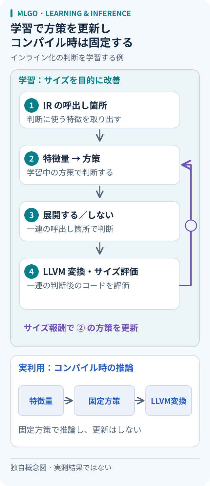

# MLGO：インライン化の判断を学習する

出典確認日：2026-10-05。2021年の原論文を読むノート。以下の小例は説明用であり、再実験ではない。

## 問い：関数を展開すれば、プログラムは小さくなるか

関数の呼出しを本体で置き換える「インライン化」には、命令の複製と、その後の簡約という両面がある。どの呼出しで展開すると最終的に得をするのか。この判断を、コンパイラの正しさを担う部分から切り離して学習できるかが読みどころになる。

## 仕組み：学習するのは二択の方策

原論文の対象はLLVMのサイズ向けインライン化。11個の数値特徴量から「展開する／しない」を選ぶニューラルネットを、PPOによる方策勾配法とEvolution Strategiesで学習する。通常の実験モデルは隠れ層40・20ユニット、ESの大型版は20ユニットの4層である。[1：§4.1.2–4.2、§6.2]

学習はコンパイラの実利用とは別に行う。IRコーパスを繰り返しコンパイルし、ネイティブコードのサイズ削減を報酬にする。各判断直後のサイズは得にくいため、方策勾配法では一連の判断全体の報酬を使う。出荷時は方策を固定し、コンパイル中には推論だけを行う。[1：§3.1、§4.1.3、§4.4]

LLVM公式文書でも、最適化判断と正しさに関わる制約を分離している。例えば展開禁止の指定を扱う部分はモデルの自由裁量にしない。入力は呼出し元・先・箇所の特徴、出力は真偽値で、実際の変換はLLVMが担当する。[2]

図：学習と実利用の境界を示す独自の概念図。原論文の図の転載ではなく、[1：§3.1、§4]と[2]をもとに整理した。推論する時点は、生成プログラムの実行時ではなくコンパイル時である。

## 小例：同じ関数でも呼出し箇所で得失が変わる

以下は本ノートで作った仮想例。他の最適化との相互作用を単純化して考える。

関数 `adjust(flag, x)` が、flagが真なら `x + 1`、偽なら `x - 1` を返すとする。

- A：`adjust(true, 7)` を展開する。定数の条件と引数が見え、結果を `8` に簡約できる候補になる。
- B：実行時まで引数が分からない三つの呼出し箇所へ同じ関数を展開する。分岐と計算が各所に複製され、サイズが増える可能性がある。

これは「Aは必ず展開、Bは禁止」という規則を提案する例ではない。呼出し先の本体を削除できるか、後続の最適化で何が消えるかによって結論は変わる。比較するなら、同じコンパイラ・入力・設定で判断だけを変え、最終コードを測る。ここではコンパイルも計測もしていない。

## どこで役立ち、何が未保証か

著者らは社内検索アプリケーションで学習・評価し、方策勾配モデルで、手書きヒューリスティックの `-Oz` に対して `.text` セクションを4.95%削減したと報告する。[1：§6.2、表2] これは当該条件のサイズの結果で、実行速度の改善率ではない。

ここからの応用判断は本ノートの考察である。容量制約のある製品を多数ビルドするなら、判断方策の改良をコンパイラに組み込み、複数のプログラムに使い回す構成が候補になる。一方、未知のコードや別のCPUでも得をするかは別途確認が必要だ。採用前にはサイズ、実行時間、コンパイル時間、回帰の件数を分けて記録したい。変換をLLVMに任せる設計にも、コンパイラの不具合が一切ないという保証までは含まれない。

## LLMによる最適化と比べる軸

比較するときは、モデル名より「何を出力するか」を先に見る。

- MLGOのこの事例：コンパイラ内部の各呼出し箇所で二択の判断を返す。
- LLMでソースを書き換える方式：新しいプログラムを候補として返し、その振る舞いを検証する。
- LLMでフラグ・パス列を選ぶ方式：コンパイラへの指示を返し、その指示で得られたコードを評価する。

この整理は比較用の見取り図であり、方式間の優劣を測った結果ではない。[コード最適化の評価](../../topics/code-optimization-evaluation.md)へ進み、変更範囲と目的指標をそろえて読む。

## 出典と確認範囲

- [1] Mircea Trofin et al., [MLGO: a Machine Learning Guided Compiler Optimizations Framework, arXiv:2101.04808v1](https://arxiv.org/html/2101.04808v1)、2021-01-13。確認：2026-10-05。§2.2（インライン化）、§3.1（設計要件）、§4.1.1–4.1.4・§4.2・§4.4（学習と報酬）、§5.1–5.3（実装）、§6.2・表2（モデルとサイズ評価）。
- [2] LLVM公式文書、[Machine Learning - Guided Optimization：Interacting with ML models](https://llvm.org/docs/MLGO.html#interacting-with-ml-models)。確認：2026-10-05。正しさに関わる判断とモデル判断の分離、入出力インターフェース。現行文書の補足であり、2021年論文の実験設定と同一とは扱わない。

[コード生成・コンパイラの入口へ戻る](../../topics/README.md#code-generation)
