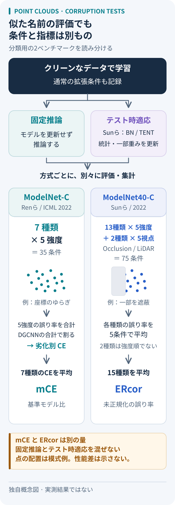

# 点群の劣化に強いとは：二つのベンチマークを読み分ける

点が欠ける、余計な点が混ざる、形が変形する。クリーンな点群の分類精度だけでは、こうした入力への強さは分からない。2022年の二つの研究は、ModelNet40由来の物体分類データを加工して、この差を測る。ただし、名前が似ていても評価集合と集計方法は別々だ。

## 出自と劣化条件

| 比較点 | ModelNet-C | ModelNet40-C |
| --- | --- | --- |
| 原著 | Ren・Pan・Liu、ICML 2022 | Sunら、arXiv:2201.12296、2022 |
| 劣化の設計 | 7種類の基本操作 | 密度・ノイズ・変形の3群、計15種類 |
| 条件数 | 各5段階、計35条件 | 13種類×5段階＋2種類×5視点、計75条件 |
| 主指標 | DGCNN基準で正規化するmCE | 基準モデルで割らない平均誤り率ERcor |

Renらの7操作は、Scale、Rotate、Jitter、Drop Global／Local、Add Global／Local。座標の変化、全体または局所の点の削除・追加を切り分ける。回転は小角度で、任意の三次元回転への不変性を測る設定ではない。[§3.1–3.3][ren]

Sunらは、密度群にOcclusion、LiDAR、局所密度の増減、Cutout、ノイズ群にUniform、Gaussian、Impulse、Upsampling、Background、変形群にRotation、Shear、FFD、RBF、Inv. RBFを置く。OcclusionとLiDARでは強度順の5段階を作らず、5視点で遮蔽を模擬する。この二つをseverity曲線へ混ぜない。[§3–4、Fig. 4][sun] 公式生成コードにも、両者のseverity引数は実際の強度を表さないと注記されている。[生成コード][generation]

PointCloud-CはRenらの系統を拡張したプロジェクト名で、分類用ModelNet-Cと部位分割用ShapeNet-Cを含む。ICML原著の分類実験と、拡張後の部位分割評価を分けて読む。[公式概要][project] ダウンロード時は名前だけで選ばず、著者と公式リポジトリまで照合したい。

図は本稿用の独自の概念図。評価条件の整理であり、論文の図の転載や実測性能の比較ではない。

## 同じ「誤り」でも、分母が違う

各条件の誤り率eは「誤分類した物体数÷評価した物体数」で、点数を分母にしない。ModelNet-Cでは種類cごとに、モデルの5段階のeの合計を、同じ条件における基準DGCNNの合計で割ってCEを求める。その7種類平均がmCEで、基準自身は1になる。種類ごとの比を平均するため、全種類の誤りを先に足して一度だけ割る計算とも異なる。[§3.3、式1–2][ren]

ModelNet40-CのERcorは、各種類の5条件平均をさらに15種類で平均した、未正規化の誤り率として読む。原著§4の式には平均の係数が省かれているが、Table 2の集計値は種類間の算術平均と整合する。ここでは平均として分母を明示した。クラスごとに等しい重みを与えるmERも、全物体を数えるERとは区別する。[§4、Table 2][sun] 公式実装も全体精度とクラス平均精度を別々に計算する。[PerfTrackVal][metrics]

**以下は2種類へ縮めた架空の計算例で、実験結果ではない。** 5条件平均の誤り率がAで10%、Bで20%、基準DGCNNがそれぞれ20%、10%なら、生の平均は15%。正規化した平均は「(10÷20＋20÷10)÷2＝1.25」になる。同じ誤りを使っても、15%と1.25は別の量だ。mCEが0.8でも「誤り率80%」を意味しない。クリーン性能からの低下を測るRenらのRmCEは、さらに別指標である。[§3.3、式3–4][ren]

## 学習と評価時の更新を分ける

クリーン学習にも通常のデータ拡張は入る。Renらは拡大縮小・平行移動を使い、評価と同じ劣化の学習時使用を禁じ、投票推論を使わない。[§3.4][ren] Sunらは劣化評価集合での学習を禁じる一方、別データへの類似劣化による拡張は明示すれば認める。[§4–5][sun]

**原著の記述で注意する点**：Ren §3.4はスケールの学習・評価範囲が非重複とするが、付録A.2の評価分布U(1/S,S)、S＝1.6〜2.0は、記載された学習範囲[2/3,3/2]と重なる。非重複を確認済みの事実として使わず、再現時は採用する版の生成コードを照合する。また§3.4はclean testで最良のモデルを選ぶと記す。これは報告されたプロトコルであり、[本稿の評価提案](../../topics/point-cloud-evaluation.md)の「検証で選択し、テスト前に固定」と区別する。

SunらのBN適応とTENTは、テスト入力からBatchNormの統計量、または統計量と一部パラメータを更新する。固定済みモデルの推論結果と同じ欄へ混ぜず、適応方法を付記する。[§5.4][sun] 公式コードでは適応をバッチごとに呼び出す。[validate関数][evaluation] 比較時には点数・前処理・学習拡張に加え、バッチサイズ、入力順、状態を初期化する単位もそろえる、というのが本稿の提案だ。

用途は、候補モデルの弱点を劣化種類ごとに診断すること。合成した劣化集合の平均から、実センサー環境全般への保証は導けない。実装の追試は未実施であり、現在の手法順位はここでは扱わない。

関連：[PointNetの構造と不変性](../2017/pointnet.md)／[点群モデルの評価条件](../../topics/point-cloud-evaluation.md)

## 出典と確認範囲

- Ren, Pan, Liu, *Benchmarking and Analyzing Point Cloud Classification under Corruptions*, ICML 2022、PMLR 162:18559–18575。[書誌](https://proceedings.mlr.press/v162/ren22c.html)と[原著PDF][ren]の§3.1–3.4・付録A.2を確認。
- Sun et al., *Benchmarking Robustness of 3D Point Cloud Recognition Against Common Corruptions*, [arXiv:2201.12296v1][sun]（2022-01-28）の§3–5、Table 2、Fig. 4を確認。ERの平均係数については本文式と表の記載を区別した。
- [PointCloud-C公式サイト][project]のOverview・Basic Statistics、[ModelNet-C公式リポジトリ](https://github.com/jiawei-ren/ModelNet-C)の統合案内、[ModelNet40-C公式リポジトリ](https://github.com/jiachens/ModelNet40-C)のREADMEを確認。
- ModelNet40-Cの確認時master（固定コミット `fad786c430c007cfbb7b4fe90ed1c9873d960921`）にある[data/generate_c.py][generation]のocclusion／lidar、[all_utils.py][metrics]のPerfTrackVal、[main.py][evaluation]のvalidateを閲読。学習・評価コードは実行していない。
- 出典確認日：2026-10-05。図、架空の計算例、比較時の確認提案は本稿独自の説明。

[ren]: https://proceedings.mlr.press/v162/ren22c/ren22c.pdf
[sun]: https://arxiv.org/pdf/2201.12296v1
[project]: https://pointcloud-c.github.io/home.html
[generation]: https://github.com/jiachens/ModelNet40-C/blob/fad786c430c007cfbb7b4fe90ed1c9873d960921/data/generate_c.py
[metrics]: https://github.com/jiachens/ModelNet40-C/blob/fad786c430c007cfbb7b4fe90ed1c9873d960921/all_utils.py
[evaluation]: https://github.com/jiachens/ModelNet40-C/blob/fad786c430c007cfbb7b4fe90ed1c9873d960921/main.py
