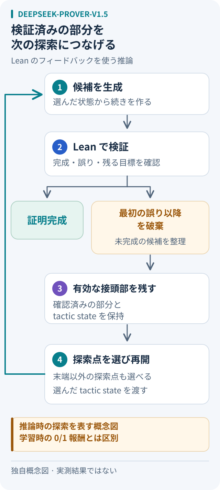

# DeepSeek-Prover-V1.5：途中の検証結果を次の証明へ返す

## 問い：失敗した証明の、どこから考え直すか

長い証明を生成し、最後に誤りが見つかったとする。最初から書き直す前に、「すでに通った部分」と「いま残っている目標」を利用できないか。本稿では、この問いから学習と探索の役割を読み分ける。

## 論文の仕組み：三つの役割

- **SFT（教師あり微調整）**：説明コメント付きの証明の続きと、途中の証明状態の予測を学ぶ。[§2.2][training]
- **RLPAF**：Leanが証明を受理すれば1、失敗なら0という報酬を使い、GRPOで生成モデルを更新する。[§2.3][rl]
- **RMaxTS**：推論時の木探索。新しい証明状態の発見を内発的報酬とし、過去の評価を割り引いて探索先を選ぶ。[§3.3][search]

生成した続きをLeanで検査し、最初の誤り以降を切り捨てる（truncate）。有効な部分を木に取り込み、選んだ節点の接頭部と実際の証明状態を与えて再開する（resume）。末端以外にも戻れる。[§3.1–3.2][resume]

図：本稿で作成した推論時の概念図。細かな探索統計は省略した。学習時にモデルを更新するRLPAFと、推論時に再開位置を選ぶRMaxTSを区別して読む。

## 小さな例：同じ仮定から取り出す成分を変える

以下は仕組みを理解するための仮想例であり、モデルの出力や実行結果ではない。

命題を「PかつQならば、QかつP」と固定する。まず仮定を `h : P ∧ Q` として受け取り、結論を二つに分ける。ここまでは有効でも、最初の目標Qに対して `h.1` を渡す候補は、Pの証明を渡してしまう。

このとき役立つのは、「失敗した」という一語よりも、仮定hと残る目標Qの組である。再開候補を `h.2` に変え、もう一方の目標Pには `h.1` を使う、という筋道を考えられる。初めの仮定導入まで捨てる必要はない。一方、もっと前の分割方針が悪ければ、その手前から別案を試す余地も欲しい。

この例では一見して正しい選択肢が分かるが、大きな証明では、未訪問の状態へ進んでも行き止まりかもしれない。「新しい状態」と「完成に近い状態」を同一視しないことが、探索を読む際の注意点になる。

## V1から何が変わるか

V1は、自然言語の問題を形式化し、品質を選別して証明を生成・検査し、合成データで反復学習する流れが中心だった。[V1 §3][v1]

本稿の整理では、V1の「学べる例を増やす」という観点に、V1.5は「検証結果でモデルを鍛える」「途中から探索を再開する」という観点を重ねている。どちらも検証器を使うので、単に「検証あり／なし」で比較すると違いを見失う。

## 数値を読む条件と使いどころ

著者報告では、miniF2F-testでRLモデルの全証明生成（CoT）は、各問題128試行の解決率が51.6±0.5%（平均±標準偏差）。RL＋RMaxTSの63.5%は、CoT／非CoTを半分ずつ使う32×6400回の生成予算である。[§4.1–4.2、表1・3][results]

これを同じ一回の回答精度として並べない。本稿で比較実験を組むなら、生成回数に加えて、検証時間・総トークン数・使用機器も記録する。途中からの短い生成と、証明全体の長い生成では、一回の費用が一致するとは限らない。タイムアウトも命題の反証には数えない。

応用案としては、形式命題とライブラリを固定できる補題証明で、「全部書き直す場合」と「途中から再開する場合」を比べる入口になる。最終的には、意図した命題が変わっていないか、未完成部分や余分な仮定が残っていないかも別途点検する。探索が成功したことと、自然言語の依頼を正しく形式化したことは、別々の確認項目にしておく。

## 関連するノート

- [生成した証明の検証手順](../../topics/formal-proof-validation.md)
- [DeepSeek-Proverの既存メモ](../undated.md#deepseek-prover)
- [形式証明のテーマ入口](../../topics/README.md#formal-proofs)

## 出典と確認範囲

確認日：2026-10-05。原論文の下記各節を読んだ整理であり、コード・モデル・ベンチマークは実行していない。例と運用案は本稿独自の説明。数値は2024年の論文内の報告で、現在の順位を示さない。

- Xin et al., [DeepSeek-Prover-V1.5: Harnessing Proof Assistant Feedback for Reinforcement Learning and Monte-Carlo Tree Search](https://arxiv.org/html/2408.08152v1), arXiv:2408.08152v1：§2.2–2.4、§3.1–3.4、§4.1–4.3、§5。
- Xin et al., [DeepSeek-Prover: Advancing Theorem Proving in LLMs through Large-Scale Synthetic Data][v1], arXiv:2405.14333v1：§3.1–3.4。

[training]: https://arxiv.org/html/2408.08152v1#S2.SS2
[rl]: https://arxiv.org/html/2408.08152v1#S2.SS3
[search]: https://arxiv.org/html/2408.08152v1#S3.SS3
[resume]: https://arxiv.org/html/2408.08152v1#S3.SS1
[results]: https://arxiv.org/html/2408.08152v1#S4.SS1
[v1]: https://arxiv.org/html/2405.14333v1#S3
