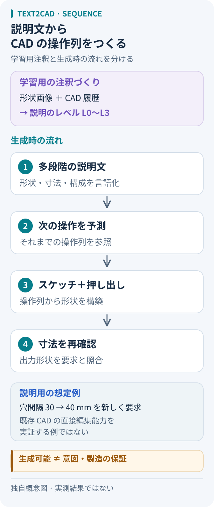

# Text2CAD：文章から、寸法を見直せる作図手順を作る

出典確認：2026-10-05。原論文の説明と、本メモの判断・想定例を分けた。モデルの推論、CAD編集、製造は未実施。

## 問い：形を得た後、どこを直せるか

「穴のある薄い板」を生成できても、後から穴間隔を変更するには、穴をどの操作で作ったか知りたい。Text2CADを読む入口は、完成形に加えて**スケッチと押し出しの手順を得る**こと。その手順が残れば、要求と食い違う寸法を探す足場になる、というのが本メモの着眼点だ。

## 学習用の説明作りと、CAD生成を分けて読む

論文には二つの仕事がある。注釈作りでは、既存CADの画像をVLMで説明し、CAD履歴と合わせてLLMが詳しさの異なる文章を作る。L0は外形、L1は平易な手順、L2は中間、L3は詳細な幾何指定を扱う。これは学習用データの準備である。[原論文 §3][paper]

生成時には、文章をBERTと適応層で符号化し、Transformerが文章と既出の列を参照して次のトークンを予測する。出力は、スケッチの座標や押し出し距離などを順番に並べたCAD列で、連続値は8ビットに量子化される。注釈用LLMがそのままCAD操作を実行する構成ではない。[原論文 §4・補足§9][paper]

図：本メモの独自概念図。論文の機構を簡略化し、最後に利用者側の寸法確認を加えた。原図の転載や実行結果ではない。

## 報告された成果を、どこまで使うか

L3の評価では、文章入力向けに変更したDeepCADに対し、図形・押し出しのF1、形状距離、無効率が改善した。一方、初心者向けL1のGPT-4V評価では勝っていない。詳しい指示での改善を、あらゆる言い方の理解へ広げない。[原論文 §5.1・表1–2][paper]

著者は注釈の視点依存と、矩形・円筒に偏るデータを限界として挙げる。[原論文 §6][paper] 本メモでは、評価の読み方も分ける。正解列との一致は、何も指定しなかった設計条件を発見した証拠にはならない。曖昧な依頼なら、どの寸法を生成側に任せたかも記録したい。

## メッシュ生成・CAD-Llamaとの位置づけ

画像から3Dメッシュを得るModlyは、写真を外形候補に変える入口になる。[公式README][modly] 穴間隔を直す場面では、表面の見え方に加え、操作と数値を参照できるかが判断点になる。

[CAD-Llamaの既存メモ](../2025/README.md#cad-llama)も併読したい。同研究は階層的な説明を添えたコード形式SPCCを学習し、追加・削除タスクも設ける。[原論文 §3.3–3.4][cad-llama] 比べる軸は入力が文章かどうかだけでなく、出力表現と編集タスクの範囲。本メモでは別論文の数値を横並びにして優劣を決めない。

## 穴間隔を変えるなら：未実施の想定例

幅60 mm、奥行20 mm、厚さ3 mmの板を考える。原点は板底面の中央、幅方向をX、奥行をY、押し出し方向を＋Zとする。直径4 mmの貫通穴をY＝0上に二つ置き、中心間隔30 mmを40 mmに変える。他の寸法は保つ。

生成列の対応する数値を編集・再実行できる環境を仮定すると、確認するのは次の三点だ。

1. 板の外周と3 mmの押し出しが変わっていないか
2. 穴中心がX＝−15／15 mmから−20／20 mmへ移り、直径4 mmを保つか
3. 再生成した形を測って間隔40 mmと貫通を確認できるか

これは本手法による対話編集の実証ではない。例のmmは仮定した実寸であり、学習データの数値から実寸への換算も確認が要る。要求を変えて新規生成する場合は、無関係な箇所まで変わっていないか、変更前後を照合する。

## 使いどころと、製造前に残る判断

本メモの判断では、寸法を点検しながら簡単な部品案を起こす研究を読むのに向く。形状が有効でも、対称性を変更後も保つ関係、材料、公差、荷重条件が満たされるとは限らない。上の寸法は説明用であり、加工・強度の設計値ではない。**幾何の成立、依頼との一致、製造適性**を別々に確かめる。

出力形式を選ぶときは[CAD表現の横断ノート](../../topics/cad-representations.md)へ。[CAD・3Dの入口](../../topics/README.md#cad-3d)から関連実装にも戻れる。

## 一次資料と確認範囲

- [NeurIPS 2024公式書誌][neurips]：Mohammad Sadil Khanほか、*Text2CAD: Generating Sequential CAD Designs from Beginner-to-Expert Level Text Prompts*、NeurIPS 37。題名・著者・会議年を確認。
- [Text2CAD原論文][paper]：arXiv:2409.17106v1、§3–6、表1–2、補足§9。本メモの技術説明・結果の根拠はこちらの全文。arXiv版の題名は「Sequential CAD Models」で、会議版の「Designs」と異なる。
- [CAD-Llama原論文][cad-llama]：arXiv:2505.04481v2、§3.3–3.4。SPCCと編集タスクの範囲を確認。
- [Modly公式README][modly]：mainの2026-10-05取得内容、概要とWorkflows。画像入力とメッシュ出力を確認。

[paper]: https://arxiv.org/html/2409.17106v1
[neurips]: https://proceedings.neurips.cc/paper_files/paper/2024/hash/0e5b96f97c1813bb75f6c28532c2ecc7-Abstract-Conference.html
[cad-llama]: https://arxiv.org/html/2505.04481v2
[modly]: https://github.com/lightningpixel/modly/blob/main/README.md
