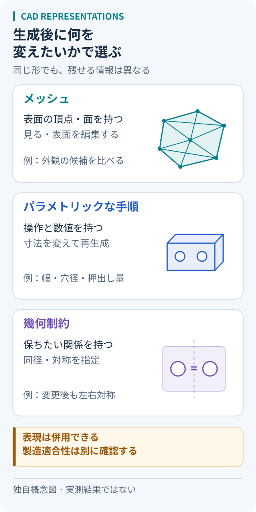

# 見た目の3Dモデルと、編集・製造に使うCADをどう選び分けるか

出典確認：2026-10-05。一次資料の説明と、本メモの判断・想定例を分けて整理した。生成ツールの実行、造形、強度試験は行っていない。

図は三つの表現の違いを説明するために作成した模式図で、論文の図の転載や加工図面ではない。寸法・強度・製造適合性を保証するものではない。

### 編集の依頼から、残す情報を選ぶ

| 次にしたいこと | 元データに残すもの | 変更後に見るところ |
| --- | --- | --- |
| 外観の候補を並べる | メッシュと生成条件 | 複数方向の見た目、欠け |
| 穴間隔だけを変える | 名前付き寸法と生成手順 | 穴間隔、穴径、板厚 |
| 幅を変えても対称にする | 基準と対称などの関係 | 関係が保たれたか |

この表は用途を整理するための判断例。表現ごとの機能を保証する一覧ではなく、使用するツールが必要な情報を保存・再利用できるかの確認に使う。

## 先に決めるのは、生成後に何を変えるか

**外観案を眺めたいならメッシュ、寸法変更を繰り返すならパラメトリックな元データを出発点にする**、というのが本メモの選び方。画像から始めるか、文章から始めるかだけでは決まらない。「穴間隔だけを変える」「幅を変えても左右対称を保つ」といった、次の編集を先に書くと判断しやすい。

## 表現の違いを三つの層で見る

- **メッシュ：出来上がった表面を持つ。** Modlyは画像から3Dメッシュを生成し、平滑化・ポリゴン削減などを扱う。写真に似た形の候補を得る入口になる。ここから寸法変更に進むときは、穴や板厚をどのように指定し直せるかを別途確かめる。[公式README][modly]
- **パラメトリックなプログラム：形を作る操作と数値を持つ。** CAD-LlamaはCADの命令列を、階層的な説明を添えたコード形式SPCCに変換して学習する。形状だけでなく、生成・編集する手順を扱う研究である。[原論文 §3][cad-llama]
- **幾何制約：変更後も保つ関係を持つ。** AIDLは部品間の関係を記述し、幾何制約ソルバーに計算を任せる。「同径」「左右対称」のような関係を設計意図として残す考え方だ。論文の実験対象は2Dであり、その結果を3D製造の保証に広げない。[原論文 §1・3][aidl]

この三つは排他的な製品分類ではない。プログラムで作った形をメッシュに書き出すこともできる。text-to-cadの公式手順では、寸法を明示したPythonソースを編集・再実行し、STEPやメッシュを生成する。**納品形式に加え、再編集用に何を残すか**を確認する。[公式CAD手順][text-to-cad]

## 用途からの選び方（本メモの整理）

1. **外観・雰囲気の比較**：画像由来のメッシュで候補を並べる。画面上の印象が目的なら有用だが、写真にない裏側や実寸は未確定として扱う。
2. **取付部品やケースの寸法調整**：単位、基準面、穴径、板厚を名前付きの値にし、変更して再生成できるCADを選ぶ。完成画像だけでなく、元ソースと変更前後の測定値を残す。
3. **関連寸法を保つ改訂**：等間隔、同心、対称など、守りたい関係を列挙する。単に各座標を数値で置いただけでは、寸法変更時の関係維持まで確認できない。

メッシュから印刷する場合もあるため、「CADかメッシュか」と「製造してよいか」は別々に判定する。表示用と製造用を併用し、用途に合う検査を通す。

## 小さな寸法変更の例（未実施の想定例）

卓上模型の位置決め用ブラケットを考える。幅60 mm、板厚3 mm、穴径4 mm、穴中心間隔30 mmとし、「幅と穴径は保ち、間隔だけ40 mmにする」と依頼する。幅方向の中心を原点にし、穴中心を「間隔の半分ずつ左右」に置けば、座標は−15／15 mmから−20／20 mmになる。

ここで比較したいのは、画像が似ているかより、編集後の穴間隔・穴径・板厚が指定どおりか、左右対称が保たれたか、という点。値の変更、再生成、保存した出力の測定、複数方向からの外観確認を一組にする。この寸法は説明用で、耐荷重や加工条件を満たす設計値ではない。

## 限界と確認事項

AIDLの原論文では、エラーを消す過程で制約を削り、設計意図が失われる例を報告している。実行に成功しても、当初の要求との照合は残る。[原論文 §4 Limitations][aidl]

本メモでは製造前の確認を、形状・寸法、材料・公差、加工条件に分けて残すことを勧める。閉じた形が生成できても、薄肉、接合部、工具や造形方式の条件は別に判断が必要。論文の生成評価やプレビューだけを、実物の機能・安全性の証明には使わない。

## 既存メモを読む順番

文章からスケッチと押し出しの列を生成する研究は、[Text2CADの図解ノート](../papers/2024/text2cad.md)へ。新規生成と既存モデルの対話編集を区別しながら読む。

1. [Modly](../articles/2026/202608.md#modly)：画像からメッシュを作る入口
2. [text-to-cad](../articles/2026/202608.md#text-to-cad)：元ソース、出力、測定をつなぐ実装
3. [CAD-Llama](../papers/2025/README.md#cad-llama)：CADの命令列をどう学習させるか
4. [AIDL](../papers/undated.md#aidl)：制約と階層で設計意図をどう表すか

## 一次資料と確認範囲

- [Modly公式README][modly]：概要、Platform notes、Workflows、CLI。mainの2026-10-05取得内容。
- [text-to-cad公式CAD手順][text-to-cad]：Create or edit a model、Mesh exports、Verify and hand off。mainの2026-10-05取得内容。
- [CAD-Llama原論文][cad-llama]：arXiv:2505.04481v2、§3.2–3.3。命令列とSPCCの構成、編集タスク。
- [AIDL原論文][aidl]：arXiv:2502.09819v1、§1・3・4。制約による表現、2Dの実験範囲、制約削除の限界。

[modly]: https://github.com/lightningpixel/modly/blob/main/README.md
[text-to-cad]: https://github.com/earthtojake/text-to-cad/blob/main/skills/cad/SKILL.md
[cad-llama]: https://arxiv.org/html/2505.04481v2
[aidl]: https://arxiv.org/html/2502.09819v1

## 関連する横断ノート

- [形式証明の検証](formal-proof-validation.md)
- [コード最適化の評価](code-optimization-evaluation.md)

[テーマ別の入口へ戻る](README.md)
