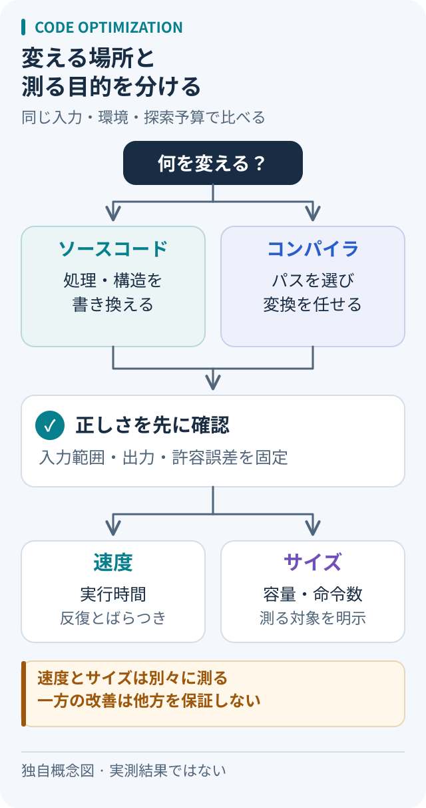

# LLMによるコード最適化を公平に比較するには何をそろえるか

出典確認日：2026-10-05。論文の評価設計を読み直した整理であり、モデルの再実験結果ではない。



図は評価設計の独自概念図。矢印は比較の手順であり、性能改善の大小や実測値を示していない。論文ごとの評価対象は以下の一次資料で確認する。

### 改善率を見る前に、単位を読む

| 指標 | 直接測っているもの | 置き換えてはいけないもの |
| --- | --- | --- |
| IR命令数 | 中間表現に含まれる命令の個数 | 実行時間そのもの |
| バイナリサイズ | 指定した出力部分のバイト数 | メモリ使用量や速度全体 |
| 実行時間 | 指定環境・入力での経過時間 | 別の入力や機器での保証 |

たとえば「10%改善」という仮の数値でも、何の10%かで意味が変わる。論文の表を写す前に、対象・単位・比較基準の三つを欄として用意する。

## まず、変えるものと測るものを分ける

比較には、**変換の段階、正しさの条件、目的指標、探索予算、実行環境**をそろえる必要がある。ソースの書き換えはアルゴリズムやデータ構造まで変えられる。IR（コンパイラの中間表現）の変換は型・制御フローなどを扱い、アセンブリの変換は命令セットやABIに制約される。入力がIRでも、出力がコンパイラのパス列なら「コードの直接生成」とは別の課題になる。

一次資料で確認できる区別は次の通り。

- **Large Language Models for Compiler Optimization** は、LLVMのパス順序を選び、`-Oz`に対するIR命令数の削減を評価する。命令数はバイナリサイズの代理指標であり、実行時間ではない。[1]
- **Meta LLM Compiler** のフラグ調整もサイズ最小化で、実際の変換はコンパイラが行う。生成パス列の検査と差分テストを併用している。[2]
- **Performance-Aligned LLMs** は、生成・書き換えたソースの正確性と速度を評価する。`pass@k`と、試行回数を含む速度指標は意味が異なる。[3]
- **IRCoder** はIRによる多言語コード生成の改善を調べる研究で、生成物の高速化の直接的な証拠にはならない。[4] **ACPO** はコンパイラ内の判断をMLで置き換える枠組みであり、LLM手法として一括集計しない。[5]

## 比較前に決めるチェックリスト

以下は上記研究を踏まえた**本ノートの提案**であり、各論文共通の実験手順ではない。

1. **正しさの条件**：入力の範囲、出力、副作用、例外、整数の桁あふれ、浮動小数点の許容誤差を固定する。コンパイル成功とテスト通過を分けて記録し、通過を全入力での同値性証明と呼ばない。
2. **比較対象**：元コード、入力、コンパイラ版をそろえる。ソース変更では同じ最適化設定でコンパイルした元コードと比べる。フラグ探索では許すパス集合を明示し、同じ目的の標準設定や探索法を基準にする。
3. **探索予算**：モデル版、プロンプト、温度、候補数、再試行、ツール呼び出しを保存する。一発生成と多数候補の最良値を混ぜず、候補選択用データと最終評価用データを分ける。
4. **測定と失敗**：CPU/GPU、OS、スレッド数、入力サイズを固定し、ウォームアップ後に順序を変えて反復する。全測定値とばらつき、誤答・クラッシュ・時間切れの件数を残す。正解した候補だけの速度を、全体の成功率と併記する。測定ノイズ低減だけでは偏りを防げない。[6]
5. **費用**：実行時間・サイズ・メモリを別々に報告する。推論・探索・検証時間も別記し、何回実行すれば最適化費用を回収できるかを判断する。

## 再現できる小例：整数列の合計

以下は比較器の例で、候補は手書きの`sum`。Python 3の標準ライブラリだけで動く。LLM比較では候補関数を各モデルの出力に替え、全候補と生成条件を保存する。掲載時点では速度を測定していない。

```python
import json
import platform
import statistics
import sys
import time


def baseline(xs):
    total = 0
    for x in xs:
        total += x
    return total


def candidate(xs):
    return sum(xs)


functions = {"baseline": baseline, "candidate": candidate}
data = tuple((17 * i + 3) % 1000 - 500 for i in range(100_000))
cases = [(), (0,), (-1, 1), (2**80, -2**80, 7), data]
for f in functions.values():
    for xs in cases:
        assert f(xs) == baseline(xs)
    for _ in range(3):
        f(data)

samples = {name: [] for name in functions}
expected = baseline(data)
for round_id in range(15):
    order = list(functions) if round_id % 2 == 0 else list(reversed(functions))
    for name in order:
        start = time.perf_counter_ns()
        for _ in range(20):
            result = functions[name](data)
        elapsed = time.perf_counter_ns() - start
        assert result == expected
        samples[name].append(elapsed / 20)
print(json.dumps({"python": sys.version, "os": platform.platform(),
                  "median_ns": {k: statistics.median(v) for k, v in samples.items()},
                  "samples_ns": samples}, indent=2))
```

同じマシン・Python版で実行し、CPU型番と電源設定も記録する。入力作成や検査を計時から外し、比率は「基準の中央値÷候補の中央値」と定義する。この小例は測定手順の確認用で、単一の入力分布・温まったキャッシュに限られる。未検査の生成コードは隔離環境で実行する。

## 使いどころと限界

組込みの容量制約ならサイズ、長時間計算なら実行時間と最適化費用を優先する。変更範囲を抑えたい場合はフラグ選択から試し、アルゴリズム変更が必要ならソースを対象にする。IRやアセンブリを使う必然性は、対象環境と検証手段から判断する。既存サーベイの改善率を横並びにせず、各一次論文の目的と分母へ戻る。

小規模テストの通過、既知ベンチマークでの改善、特定CPUでの勝利は、未知入力や別環境の保証にならない。学習データとの重複が不明なら、その不確実性も結果に残す。

## 次に読む既存メモ

[MLGOの図解ノート](../papers/2021/mlgo.md)では、ソースを書き換える生成器を使わず、コンパイラ内の判断を学習する例を扱う。学習と利用時の推論を分けて考える入口になる。

1. [Large Language Models for Compiler Optimization](../papers/undated.md#llm-compiler-optimization)：パス選択とIR命令数の関係
2. [Meta LLM Compiler](../papers/undated.md#meta-llm-compiler)：サイズ評価と生成パス列の検査
3. [Performance-Aligned LLMs](../papers/2024/README.md#performance-aligned-llms)：正確性・速度・試行回数の扱い
4. [IRCoder](../papers/2024/README.md#ircoder)：IRを学習することと高速化の違い

## 出典と確認範囲

- [1] [Cummins et al., Large Language Models for Compiler Optimization, arXiv:2309.07062v1](https://arxiv.org/pdf/2309.07062v1)：II、IV-B・D。目的指標、比較基準、生成コード評価。
- [2] [Cummins et al., Meta Large Language Model Compiler, arXiv:2407.02524v1](https://arxiv.org/html/2407.02524v1)：2.2、3.1、5.1。バイナリサイズの定義、パス選択と正確性確認。
- [3] [Nichols et al., Performance-Aligned LLMs for Generating Fast Code, arXiv:2404.18864v1](https://arxiv.org/html/2404.18864v1)：VI、VII-A・D、VIII。指標、比較モデル、評価条件。
- [4] [Paul et al., IRCoder, ACL 2024](https://aclanthology.org/2024.acl-long.802.pdf)：4、5。多言語生成・理解の評価。
- [5] [ACPO: AI-Enabled Compiler-Driven Program Optimization, arXiv:2312.09982v1](https://arxiv.org/html/2312.09982v1)：4.2、5.1.1。コンパイラ内の判断とMLモデル構成。
- [6] [LLVM公式文書：Benchmarking tips](https://llvm.org/docs/Benchmarking.html)：Introduction、General。反復測定とノイズ・偏りの区別。

## 関連する横断ノート

- [形式証明の検証](formal-proof-validation.md)
- [CADと3D表現の選び分け](cad-representations.md)

[テーマ別の入口へ戻る](README.md)
