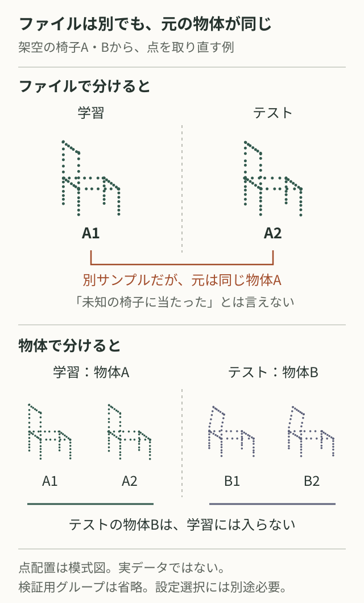

# 点群モデルの頑健性を、漏洩なく再現可能に評価する

出典確認日：2026-10-05。公開一次資料を横断した評価手順の提案。以下の想定例・チェック表は本ノートの整理であり、実験結果ではない。

図：分割と情報の流れを示す独自概念図。同じ取得元の派生データは分割境界を越えない。矢印は性能差を表さない。

## 「頑健」の対象を三つに分ける

- **点の順序**：同じ点集合を並べ替えたときの出力の一致。PointNetは対称な集約で分類出力の順序不変性を扱う。点ごとの予測は対応する順序へ戻して比較する。[1]
- **幾何的な劣化**：座標ノイズ、欠落、密度変化、回転などへの性能低下。順序不変性だけでは保証されない。劣化の種類・強度と無劣化時を別々に記録する。
- **未知の対象への汎化**：未学習の物体、取得セッション、被験者などへの性能。既知物体を再サンプリングした評価とは分ける。

同じ「点群の頑健性」でも分母と問いが異なる。ModelNet-CとModelNet40-Cの指標も混ぜず、[ベンチマーク比較](../papers/2022/point-cloud-corruptions.md)で正式名称・版・集計法を確認する。

## 分割は取得元から始める

KapoorとNarayananは重複、前処理、学習・テスト間の依存などを漏洩の類型として整理している。[2] 未知物体を測るなら物体ID、未知セッションならセッションID、未知被験者なら被験者IDを分割単位にする。複数の依存関係がまたがる場合は、複合キーを付けるだけで分離できるとは限らない。

**想定例**：物体Aの同じスキャンから点群A1とA2を抽出し、A1を学習、A2をテストへ入れると、未知物体Bへの汎化を測ったことにはならない。別名ファイル、再サンプリング、拡張前の元形状を取得元IDで追い、同じ側へまとめる。ファイルのハッシュ一致だけでは派生重複を発見できない。

分割を確定してから拡張する。全体から推定する正規化統計や特徴選択は、交差検証の各foldでも学習側だけでfitし、検証・テストへ同じ変換を適用する。[3] 各入力点群だけで行う固定の中心合わせ・尺度合わせは別扱いとし、利用可能な情報と失われる位置・尺度を明記する。GroupKFoldは指定グループをfold間で分離するが、適切なIDの発見や将来時点への分割までは代行しない。[4]

## 選択を終えてからテストを開く

学習で重みを更新し、検証でハイパーパラメータ・停止時点・チェックポイントを選ぶ。テスト確認前に分割、前処理、評価条件、seed一覧を固定する。テスト結果を見て調整した場合は、その事実を記録し、独立した最終評価と呼ばない。

テスト時適応ではモデルや統計が更新され得る。[5] 正解ラベル使用の有無、更新対象、更新前後どちらを採点するかを宣言する。教師なし条件で正解ラベルを適応や設定選択に使わない。単一例・バッチ・全テスト集合のどこまで参照できるか、ストリーム順序、リセット境界、未来データ参照の可否も固定する。

| 確認箇所 | 比較前にそろえるもの |
| --- | --- |
| 入力 | 点数、座標単位、属性、サンプリング、正規化のfit範囲 |
| 分割 | 取得元ID、重複の扱い、各splitの対象数・クラス内訳 |
| 劣化 | 生成コード版、種類・強度、乱数、適用順序 |
| 選択 | 検証指標、探索予算、停止条件、全seedと失敗試行 |
| 採点 | 物体／点／クラス平均の定義、適応範囲、欠損予測の扱い |

## 点数を独立試行数に数えない

物体分類では物体ごとに採点する。点ごとのセグメンテーションでは、物体ごとのIoUを平均するか、全点をまとめるかで重みが変わるため定義を残す。同一物体の点や劣化違いを、独立に取得した対象のように数えない。

学習seedを変える反復と、対象を取り直す反復は別の不確実性を測る。分割と対象を対応させた手法間比較を基本とし、区間推定を行うなら依存構造に合う再標本化単位と仮定を説明する。固定seedは再実行を助けるが、単一試行で十分という根拠にはならない。試行数・対象数・全結果を残す。[3]

## 再実行用の記録を一組にする

保存するmanifestには、dataset名・version、取得元IDとsplit一覧、そのhash、前処理設定と学習済み統計、分割・学習・劣化のseeds、コードcommit、依存版・OS・機器、checkpointと選択理由、metricの定義、対象ID付きraw predictionsを含める。ラベル対応、失敗ログ、適応の設定も保存し、集計値から元予測へ戻れるようにする。

## 出典と確認範囲

- [1] [Qi et al., PointNet: Deep Learning on Point Sets for 3D Classification and Segmentation, arXiv:1612.00593v2](https://arxiv.org/html/1612.00593v2)：3、4.1–4.2。分類・点ごとの予測と対称集約。
- [2] [Kapoor & Narayanan, Leakage and the Reproducibility Crisis in ML-based Science, arXiv:2207.07048v1](https://arxiv.org/html/2207.07048v1)：2.4、3.2–3.4、付録C。本文を確認した版。出版版は [Leakage and the reproducibility crisis in machine-learning-based science, Patterns 4(9), 100804 (2023)](https://doi.org/10.1016/j.patter.2023.100804)。版間の調査件数は本ノートでは利用していない。
- [3] [scikit-learn公式：Common pitfalls and recommended practices](https://scikit-learn.org/stable/common_pitfalls.html)：12.2–12.3。分割後の前処理、乱数制御。参照は更新されるstable文書。
- [4] [scikit-learn公式：GroupKFold](https://scikit-learn.org/stable/modules/generated/sklearn.model_selection.GroupKFold.html)：定義、groups、shuffle、random_state。グループ非重複の条件を確認。
- [5] [Sun et al., Benchmarking Robustness of 3D Point Cloud Recognition Against Common Corruptions, arXiv:2201.12296v1](https://arxiv.org/html/2201.12296v1)：4、5.4。劣化評価とテスト時のBatchNorm／TENT更新。上記の保存項目全体は論文共通の仕様ではなく本ノートの提案。

## 関連ノート

- [PointNet](../papers/2017/pointnet.md) → [PointNet++](../papers/2017/pointnet-plus-plus.md)：集合の集約と局所構造を読む
- [コード最適化の評価](code-optimization-evaluation.md)：指標・探索予算・測定条件をそろえる
- [CAD・3Dの入口へ戻る](README.md#cad-3d)
